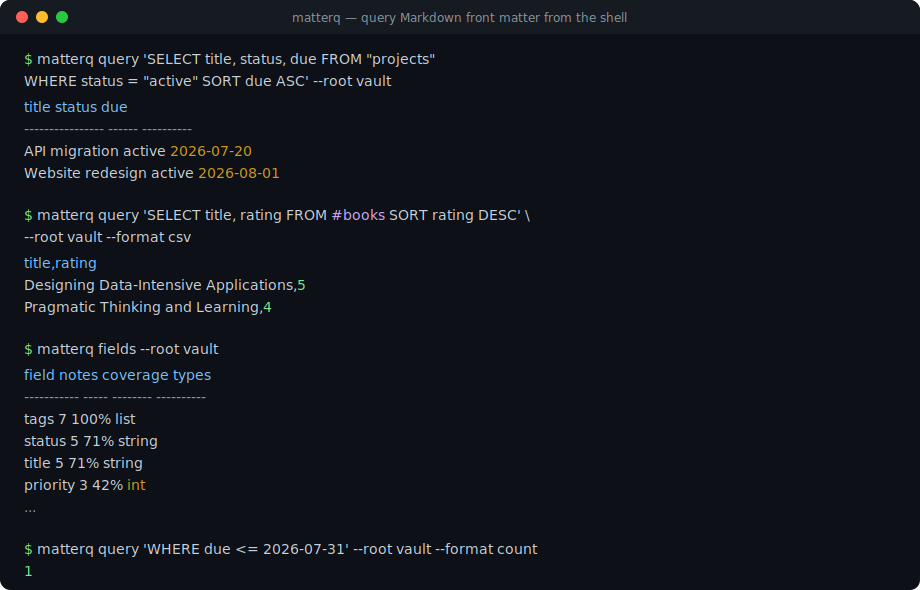
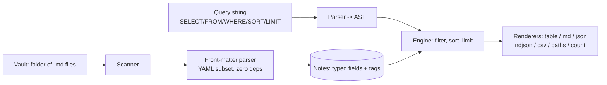

# matterq

[English](README.md) | [中文](README.zh.md) | [日本語](README.ja.md)

[](LICENSE) [](CHANGELOG.md) [](pyproject.toml)  [](CONTRIBUTING.md)

**front matter で Markdown フォルダ全体をクエリ：フィルタ・ソート・射影して表や JSON を出力 —— Dataview 風クエリをスクリプト・cron・CI へ。**



```bash
git clone https://github.com/JaydenCJ/matterq && cd matterq && pip install -e .
```

> **プレリリース：** matterq はまだ PyPI に公開されていません。初回リリースまでは [JaydenCJ/matterq](https://github.com/JaydenCJ/matterq) をクローンし、リポジトリのルートで `pip install -e .` を実行してください。

## なぜ matterq？

front matter 付き Markdown でノートを管理しているなら、それはもうデータベースです —— しかし最良のクエリエンジンである Obsidian の Dataview は GUI プラグインの中に閉じ込められています。シェルスクリプトからも cron からも CI パイプラインからも呼べず、「期限切れノートがあればビルドを落とす」「週報を CSV で出す」となった途端、`grep` と手書きの YAML パースに逆戻りです。汎用ツールでも埋まりません：`yq` は一度に 1 ファイルで Markdown を知らず、`grep`/`awk` に見えるのは型のないテキストだけ。matterq がその欠けた 1 ピースです：自前の front-matter パーサ（依存ゼロ、YAML 1.2 スカラー意味論）を持つヘッドレスエンジンに、5 句のクエリ言語とパイプ向きの出力 —— 人には表、機械には JSON/NDJSON/CSV、CI には終了コードを。

|  | matterq | Dataview | yq + find | grep/awk |
|---|---|---|---|---|
| ヘッドレス実行（スクリプト・cron・CI） | ○ | ×（Obsidian プラグイン） | ○ | ○ |
| Markdown フォルダ全体をクエリ | ○ | ○ | 1 ファイルずつ | テキストのみ |
| 型付きフィールド（日付・数値・リスト） | ○ | ○ | YAML のみ、Markdown 分離不可 | × |
| front matter **と**本文のタグを両方認識 | ○ | ○ | × | 手書き正規表現 |
| クエリ言語（フィルタ/ソート/射影） | ○ | ○ | ファイルごとに jq 式 | × |
| ランタイム依存 | 0 | Obsidian | Go バイナリ | — |

<sub>matterq の依存数は [pyproject.toml](pyproject.toml) の `dependencies = []` そのもの。front-matter パーサはパッケージの一部であり、PyYAML ではありません。</sub>

## 特長

- **本物のクエリ言語** —— `SELECT title, due FROM "projects" WHERE status = "open" SORT due ASC LIMIT 10`：5 つの句、括弧付きブール論理、`CONTAINS`/`IN`/`MATCHES`、日付として比較される日付リテラル。
- **自前の front-matter パーサ** —— 依存ゼロ、YAML 1.2 スカラー意味論（`no` は文字列のまま）、型付き日付・ブロックスカラー・ネストしたマッピング。対応サブセットは文書化された契約です。
- **雑然とした vault のための設計** —— 欠けたフィールドはエラーでなく `null`、型をまたぐ比較はクラッシュでなく `false`、壊れたノートは stderr の警告になりクエリは走り続けます。
- **パイプ向きの出力** —— 目には整列した表、ノートに貼るなら `md`、スクリプトへは `json`/`ndjson`、表計算へは `csv`、`xargs` へは `paths`、CI ゲートには `count` と `--fail-empty`。
- **タグ処理も抜かりなく** —— front matter のタグと本文のインライン `#tags` をマージして重複排除し、コードブロックや見出しは正しく無視。`FROM #tag` がそのまま動きます。
- **構造からして決定的** —— ソートは安定したパスのタイブレーク付きで `null` は常に最後。同じ vault からは常にバイト単位で同一の出力が得られます。

## クイックスタート

インストールして、同梱のサンプル vault に対して実行：

```bash
git clone https://github.com/JaydenCJ/matterq && cd matterq && pip install -e .
cd examples
matterq query 'SELECT title, status, due FROM "projects" WHERE status = "active" SORT due ASC' --root vault
```

```text
title             status  due
----------------  ------  ----------
API migration     active  2026-07-20
Website redesign  active  2026-08-01
```

同じエンジンで機械可読に —— 日付は ISO 文字列にシリアライズ：

```bash
matterq query 'SELECT title, due WHERE due <= 2026-07-31' --root vault --format json
```

```text
[
  {
    "title": "API migration",
    "due": "2026-07-20"
  }
]
```

見知らぬ vault が相手？まず何をクエリできるか聞きましょう（出力は `...` で省略）：

```bash
matterq fields --root vault
```

```text
field        notes  coverage  types
-----------  -----  --------  ----------
tags         7      100%      list
status       5      71%       string
title        5      71%       string
priority     3      42%       int
...
```

## クエリ言語

1 つの文字列、5 つの省略可能な句、この順序で（完全なリファレンス：[`docs/query-language.md`](docs/query-language.md)）：

| 句 | 例 | 備考 |
|---|---|---|
| `SELECT` | `SELECT title, owner.team` | ドット区切りパスはネストしたマッピングへ降りる。`*` か省略 = ファイルパスのみ |
| `FROM` | `FROM "projects", #books` | フォルダ接頭辞とタグ。カンマ区切りのソースは OR で結合 |
| `WHERE` | `WHERE due <= 2026-07-31 AND NOT #done` | `=` `!=` `<` `<=` `>` `>=` `CONTAINS` `IN` `MATCHES`、`AND`/`OR`/`NOT`、括弧 |
| `SORT` | `SORT priority ASC, due DESC` | 複数キー。`null` は常に最後。同順はパスで決着 |
| `LIMIT` | `LIMIT 10` | ソート後に適用 |

各ノートには暗黙のフィールドも付きます：`file.path`・`file.name`・`file.folder`・`file.ext`・`file.size`、そしてマージ済みの `tags`。

## 出力フォーマット

| フォーマット | 効果 |
|---|---|
| `table`（デフォルト） | ターミナル向けに整列したプレーンテキスト列 |
| `md` | GitHub 風 Markdown 表（パイプ記号はエスケープ済み） |
| `json` / `ndjson` | 型付きレコード。`SELECT` なしなら各ノートの front matter 全体 |
| `csv` | ヘッダ行 + エスケープ済みセル、そのまま表計算へ |
| `paths` | 1 行 1 相対パス —— `xargs` に流し込めます |
| `count` | 行数のみ。シェルの判定と組み合わせて CI ゲートに |

`--fail-empty` を付けると `matterq query` はマッチ 0 件で終了コード 1 を返すので、「週次レビューのノートが存在すること」が 1 行の CI チェックになります。

## 検証

このリポジトリは CI を持ちません。上記の主張はすべてローカル実行で検証しています。このリポジトリのチェックアウトから再現できます：

```bash
pip install -e '.[dev]' && pytest && bash scripts/smoke.sh
```

出力（実際の実行からコピー、`...` で省略）：

```text
92 passed in 0.47s
...
[csv] Designing Data-Intensive Applications,5
SMOKE OK
```

## アーキテクチャ



## ロードマップ

- [x] front-matter パーサ、クエリ言語、スキャナ、7 種の出力フォーマット、`fields`/`get` サブコマンド、CI 向け終了コード（v0.1.0）
- [ ] PyPI への公開（`pip install matterq`）
- [ ] `SELECT` での計算フィールド（算術、`date()` 関数、エイリアス）
- [ ] 集約付き `GROUP BY`（`count`・`min`・`max`）
- [ ] watch モード：vault の変更でクエリを自動再実行
- [ ] Wikilink グラフフィールド（`file.inlinks`・`file.outlinks`）

完全なリストは [open issues](https://github.com/JaydenCJ/matterq/issues) を参照してください。

## コントリビュート

コントリビューション歓迎です —— [good first issue](https://github.com/JaydenCJ/matterq/issues?q=is%3Aissue+is%3Aopen+label%3A%22good+first+issue%22) から始めるか、[discussion](https://github.com/JaydenCJ/matterq/discussions) を開いてください。開発環境のセットアップは [CONTRIBUTING.md](CONTRIBUTING.md) を参照。

## ライセンス

[MIT](LICENSE)
