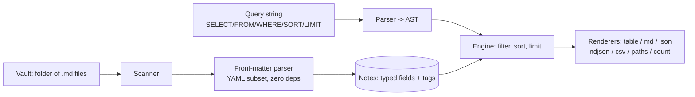

# matterq

[English](README.md) | [中文](README.zh.md) | [日本語](README.ja.md)

[](LICENSE) [](CHANGELOG.md) [](pyproject.toml)  [](CONTRIBUTING.md)

**Query a folder of Markdown by front matter: filter, sort, project, output tables or JSON — Dataview-style queries for scripts, cron, and CI.**


```bash
git clone https://github.com/JaydenCJ/matterq && cd matterq && pip install -e .
```

> **Pre-release:** matterq is not yet published to PyPI. Until the first release, clone [JaydenCJ/matterq](https://github.com/JaydenCJ/matterq) and run `pip install -e .` from the repository root.

## Why matterq?

If you keep notes as Markdown files with front matter, you already have a database — but the best query engine for it, Obsidian's Dataview, is trapped inside a GUI plugin. You cannot call it from a shell script, a cron job, or a CI pipeline; the moment you want "overdue notes fail the build" or "weekly report as CSV", you are down to `grep` and hand-rolled YAML parsing. Generic tools do not close the gap either: `yq` sees one file at a time and no Markdown, and `grep`/`awk` see text, not typed data. matterq is that missing piece: a headless engine with its own front-matter parser (zero dependencies, YAML 1.2 scalar semantics), a five-clause query language, and pipe-friendly output — tables for humans, JSON/NDJSON/CSV for machines, exit codes for CI.

|  | matterq | Dataview | yq + find | grep/awk |
|---|---|---|---|---|
| Runs headless (scripts, cron, CI) | Yes | No (Obsidian plugin) | Yes | Yes |
| Queries a whole folder of Markdown | Yes | Yes | One file at a time | Text only |
| Typed fields (dates, numbers, lists) | Yes | Yes | YAML only, no Markdown split | No |
| Tags from front matter **and** body | Yes | Yes | No | Manual regex |
| Query language (filter/sort/project) | Yes | Yes | jq expressions per file | No |
| Runtime dependencies | 0 | Obsidian | Go binary | — |

<sub>matterq's dependency count is `dependencies = []` in [pyproject.toml](pyproject.toml); the front-matter parser is part of the package, not PyYAML.</sub>

## Features

- **A real query language** — `SELECT title, due FROM "projects" WHERE status = "open" SORT due ASC LIMIT 10`: five clauses, boolean logic with parentheses, `CONTAINS`/`IN`/`MATCHES`, date literals that compare as dates.
- **Its own front-matter parser** — zero dependencies, YAML 1.2 scalar semantics (`no` stays a string), typed dates, block scalars, nested mappings; the exact subset is a documented contract.
- **Built for messy vaults** — missing fields are `null` not errors, cross-type comparisons are `false` not crashes, malformed notes become stderr warnings while the query still runs.
- **Pipe-friendly output** — aligned tables for eyes, `md` for pasting into notes, `json`/`ndjson` for scripts, `csv` for spreadsheets, `paths` for `xargs`, `count` plus `--fail-empty` for CI gates.
- **Tags done right** — front-matter tags and inline `#tags` from the body are merged and deduplicated, with code blocks and headings correctly ignored; `FROM #tag` just works.
- **Deterministic by construction** — results sort with a stable path tiebreaker and `null` always last, so the same vault always produces byte-identical output.

## Quickstart

Install, then run against the bundled example vault:

```bash
git clone https://github.com/JaydenCJ/matterq && cd matterq && pip install -e .
cd examples
matterq query 'SELECT title, status, due FROM "projects" WHERE status = "active" SORT due ASC' --root vault
```

```text
title             status  due
----------------  ------  ----------
API migration     active  2026-07-20
Website redesign  active  2026-08-01
```

Same engine, machine-readable — dates serialize as ISO strings:

```bash
matterq query 'SELECT title, due WHERE due <= 2026-07-31' --root vault --format json
```

```text
[
  {
    "title": "API migration",
    "due": "2026-07-20"
  }
]
```

Facing an unfamiliar vault? Ask what is queryable first (output truncated with `...`):

```bash
matterq fields --root vault
```

```text
field        notes  coverage  types
-----------  -----  --------  ----------
tags         7      100%      list
status       5      71%       string
title        5      71%       string
priority     3      42%       int
...
```

## Query language

One string, five optional clauses, in this order (full reference: [`docs/query-language.md`](docs/query-language.md)):

| Clause | Example | Notes |
|---|---|---|
| `SELECT` | `SELECT title, owner.team` | Dotted paths descend into nested mappings; `*` or omitted = file path only |
| `FROM` | `FROM "projects", #books` | Folder prefixes and tags; comma-separated sources combine as OR |
| `WHERE` | `WHERE due <= 2026-07-31 AND NOT #done` | `=` `!=` `<` `<=` `>` `>=` `CONTAINS` `IN` `MATCHES`, `AND`/`OR`/`NOT`, parentheses |
| `SORT` | `SORT priority ASC, due DESC` | Multi-key; `null` always sorts last; ties break on path |
| `LIMIT` | `LIMIT 10` | Applied after sorting |

Every note also carries implicit fields: `file.path`, `file.name`, `file.folder`, `file.ext`, `file.size`, and merged `tags`.

## Output formats

| Format | Effect |
|---|---|
| `table` (default) | Aligned plain-text columns for terminals |
| `md` | GitHub-flavored Markdown table (pipes escaped) |
| `json` / `ndjson` | Typed records; without `SELECT`, full front matter per note |
| `csv` | Header row + escaped cells, ready for spreadsheets |
| `paths` | One relative path per line — pipe into `xargs` |
| `count` | Row count only; combine with shell tests for CI gates |

`--fail-empty` makes `matterq query` exit 1 when nothing matched, so "the weekly review note must exist" is a one-line CI check.

## Verification

This repository ships no CI; every claim above is verified by local runs. Reproduce them from a checkout of this repository:

```bash
pip install -e '.[dev]' && pytest && bash scripts/smoke.sh
```

Output (copied from a real run, truncated with `...`):

```text
92 passed in 0.47s
...
[csv] Designing Data-Intensive Applications,5
SMOKE OK
```

## Architecture



## Roadmap

- [x] Front-matter parser, query language, scanner, seven output formats, `fields`/`get` subcommands, CLI exit codes for CI (v0.1.0)
- [ ] PyPI release with `pip install matterq`
- [ ] Computed fields in `SELECT` (arithmetic, `date()` functions, aliases)
- [ ] `GROUP BY` with aggregates (`count`, `min`, `max`)
- [ ] Watch mode: re-run a query when the vault changes
- [ ] Wikilink graph fields (`file.inlinks`, `file.outlinks`)

See the [open issues](https://github.com/JaydenCJ/matterq/issues) for the full list.

## Contributing

Contributions are welcome — start with a [good first issue](https://github.com/JaydenCJ/matterq/issues?q=is%3Aissue+is%3Aopen+label%3A%22good+first+issue%22) or open a [discussion](https://github.com/JaydenCJ/matterq/discussions). See [CONTRIBUTING.md](CONTRIBUTING.md) for the development setup.

## License

[MIT](LICENSE)
