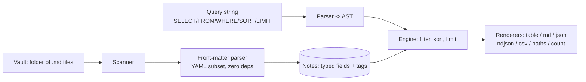

# matterq

[English](README.md) | [中文](README.zh.md) | [日本語](README.ja.md)

[](LICENSE) [](CHANGELOG.md) [](pyproject.toml)  [](CONTRIBUTING.md)

**用 front matter 查询整个 Markdown 文件夹：过滤、排序、投影，输出表格或 JSON —— 把 Dataview 式查询带进脚本、cron 和 CI。**


```bash
git clone https://github.com/JaydenCJ/matterq && cd matterq && pip install -e .
```

> **预发布：** matterq 尚未发布到 PyPI。首个正式版发布前，请克隆 [JaydenCJ/matterq](https://github.com/JaydenCJ/matterq) 并在仓库根目录执行 `pip install -e .`。

## 为什么选 matterq？

如果你的笔记是带 front matter 的 Markdown 文件，你其实已经拥有一个数据库 —— 但它最好的查询引擎、Obsidian 的 Dataview，被困在一个 GUI 插件里。你没法从 shell 脚本、cron 任务或 CI 流水线里调用它；一旦想要“有逾期笔记就让构建失败”或“把周报导出成 CSV”，就只能退回 `grep` 和手写 YAML 解析。通用工具也补不上这个缺口：`yq` 一次只看一个文件、不懂 Markdown，`grep`/`awk` 看到的是文本而不是有类型的数据。matterq 就是缺的那一块：一个自带 front-matter 解析器（零依赖、YAML 1.2 标量语义）的无头引擎，配一门五子句查询语言和管道友好的输出 —— 表格给人看，JSON/NDJSON/CSV 给机器，退出码给 CI。

|  | matterq | Dataview | yq + find | grep/awk |
|---|---|---|---|---|
| 无头运行（脚本、cron、CI） | 是 | 否（Obsidian 插件） | 是 | 是 |
| 查询整个 Markdown 文件夹 | 是 | 是 | 一次一个文件 | 只有文本 |
| 类型化字段（日期、数字、列表） | 是 | 是 | 只懂 YAML，不会切分 Markdown | 否 |
| 同时识别 front matter **和**正文标签 | 是 | 是 | 否 | 手写正则 |
| 查询语言（过滤/排序/投影） | 是 | 是 | 逐文件写 jq 表达式 | 否 |
| 运行时依赖 | 0 | Obsidian | Go 二进制 | — |

<sub>matterq 的依赖数就是 [pyproject.toml](pyproject.toml) 里的 `dependencies = []`；front-matter 解析器是包的一部分，不是 PyYAML。</sub>

## 功能特性

- **一门真正的查询语言** —— `SELECT title, due FROM "projects" WHERE status = "open" SORT due ASC LIMIT 10`：五个子句、带括号的布尔逻辑、`CONTAINS`/`IN`/`MATCHES`，日期字面量按日期比较。
- **自带 front-matter 解析器** —— 零依赖，YAML 1.2 标量语义（`no` 仍是字符串），类型化日期、块标量、嵌套映射；支持的子集是一份写成文档的契约。
- **为凌乱的笔记库设计** —— 缺失字段是 `null` 而不是报错，跨类型比较是 `false` 而不是崩溃，坏掉的笔记只在 stderr 警告，查询照常运行。
- **管道友好的输出** —— 对齐表格给眼睛看，`md` 可直接粘回笔记，`json`/`ndjson` 给脚本，`csv` 给表格软件，`paths` 喂给 `xargs`，`count` 加 `--fail-empty` 做 CI 门禁。
- **标签处理到位** —— front matter 标签与正文里的行内 `#tags` 合并去重，代码块和标题被正确忽略；`FROM #tag` 开箱即用。
- **构造上就是确定性的** —— 结果排序带稳定的路径决胜键，`null` 永远排最后，同一笔记库永远产生逐字节一致的输出。

## 快速上手

安装后，直接对自带的示例笔记库运行：

```bash
git clone https://github.com/JaydenCJ/matterq && cd matterq && pip install -e .
cd examples
matterq query 'SELECT title, status, due FROM "projects" WHERE status = "active" SORT due ASC' --root vault
```

```text
title             status  due
----------------  ------  ----------
API migration     active  2026-07-20
Website redesign  active  2026-08-01
```

同一引擎，机器可读 —— 日期序列化为 ISO 字符串：

```bash
matterq query 'SELECT title, due WHERE due <= 2026-07-31' --root vault --format json
```

```text
[
  {
    "title": "API migration",
    "due": "2026-07-20"
  }
]
```

面对陌生的笔记库？先问问有什么可查（输出以 `...` 截断）：

```bash
matterq fields --root vault
```

```text
field        notes  coverage  types
-----------  -----  --------  ----------
tags         7      100%      list
status       5      71%       string
title        5      71%       string
priority     3      42%       int
...
```

## 查询语言

一个字符串、五个可选子句、按此顺序（完整参考：[`docs/query-language.md`](docs/query-language.md)）：

| 子句 | 示例 | 说明 |
|---|---|---|
| `SELECT` | `SELECT title, owner.team` | 点号路径深入嵌套映射；`*` 或省略 = 只输出文件路径 |
| `FROM` | `FROM "projects", #books` | 文件夹前缀和标签；逗号分隔的来源按 OR 组合 |
| `WHERE` | `WHERE due <= 2026-07-31 AND NOT #done` | `=` `!=` `<` `<=` `>` `>=` `CONTAINS` `IN` `MATCHES`、`AND`/`OR`/`NOT`、括号 |
| `SORT` | `SORT priority ASC, due DESC` | 多键排序；`null` 永远排最后；平局按路径决胜 |
| `LIMIT` | `LIMIT 10` | 在排序之后生效 |

每条笔记还带隐式字段：`file.path`、`file.name`、`file.folder`、`file.ext`、`file.size`，以及合并后的 `tags`。

## 输出格式

| 格式 | 效果 |
|---|---|
| `table`（默认） | 终端里对齐的纯文本列 |
| `md` | GitHub 风格 Markdown 表格（管道符已转义） |
| `json` / `ndjson` | 类型化记录；不带 `SELECT` 时输出每条笔记的完整 front matter |
| `csv` | 表头行 + 转义单元格，可直接进表格软件 |
| `paths` | 每行一个相对路径 —— 直接管给 `xargs` |
| `count` | 只输出行数；配合 shell 判断做 CI 门禁 |

`--fail-empty` 让 `matterq query` 在无匹配时以 1 退出，于是“每周回顾笔记必须存在”只需一行 CI 检查。

## 验证

本仓库不带 CI；上面每一条主张都由本地运行验证。在本仓库的检出目录里即可复现：

```bash
pip install -e '.[dev]' && pytest && bash scripts/smoke.sh
```

输出（摘自一次真实运行，用 `...` 截断）：

```text
92 passed in 0.47s
...
[csv] Designing Data-Intensive Applications,5
SMOKE OK
```

## 架构



## 路线图

- [x] front-matter 解析器、查询语言、扫描器、七种输出格式、`fields`/`get` 子命令、面向 CI 的退出码（v0.1.0）
- [ ] 发布到 PyPI，支持 `pip install matterq`
- [ ] `SELECT` 里的计算字段（算术、`date()` 函数、别名）
- [ ] 带聚合的 `GROUP BY`（`count`、`min`、`max`）
- [ ] watch 模式：笔记库变化时自动重跑查询
- [ ] Wikilink 图谱字段（`file.inlinks`、`file.outlinks`）

完整列表见 [open issues](https://github.com/JaydenCJ/matterq/issues)。

## 参与贡献

欢迎贡献 —— 从一个 [good first issue](https://github.com/JaydenCJ/matterq/issues?q=is%3Aissue+is%3Aopen+label%3A%22good+first+issue%22) 开始，或发起一个 [discussion](https://github.com/JaydenCJ/matterq/discussions)。开发环境搭建见 [CONTRIBUTING.md](CONTRIBUTING.md)。

## 许可证

[MIT](LICENSE)
